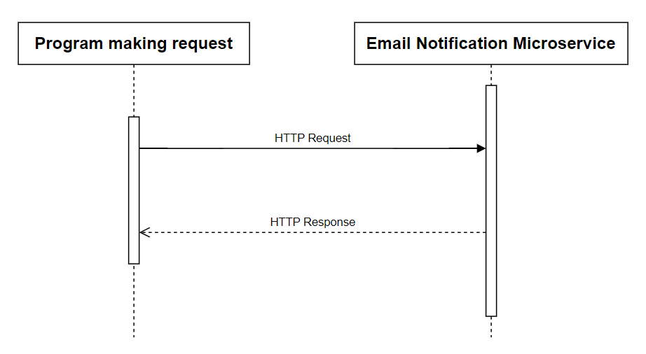

# Email Notification Microservice

### How to make requests to microservice

Communication between your program and the microservice is achieved via HTTP requests and responses.

Your program sends a POST request to the Email Notification Microservice.

Refer to the [`tester.js`](https://github.com/dreniff3/osu-cs361-microservice/blob/main/tester.js "Test File") file for an example of how that can be done.

In that example, Node.js's built-in `http` module is used to accomplish this:

**1. Prepare request data:** a JSON string containing the user's email address (`userEmail`) and purchase details (`purchaseDetails`) is constructed. This data represents the information that will be sent to the Email Notification Service.

**2. Set up request options:** define options for the HTTP request, including the hostname (`localhost`), port (`3000`), path (`/api/sendEmail`), request method (`POST`), and headers specifying the content type (`application/json`) and content length (`data.length`).

**3. Create HTTP request:** using the `http.request()` method, create a new HTTP request object (`req`) which encapsulates the details of the request (`options`) to be sent to the Email Notification Microservice.

**4. Handle response:** define event handlers to handle the response from the Email Notification Microservice: when data is received (`res.on('data')`), it is concatenated to a `resBody` variable; when the response is complete (`res.on('end')`), the `resBody` is logged to the console.

**5. Handle errors:** define an event handler to handle errors that occur during the request (`req.on('error')`): if an error occurs, it is logged to the console.

**6. Send request:** finally, the request data is written to the request body using `req.write(data)` and then the request is ended with `req.end()`.

### How the microservice responds to requests

The Email Notification Microservice listens for incoming POST requests on the `/api/sendEmail` endpoint, and responds to them with either a success message or an error message.

### UML Sequence Diagram

